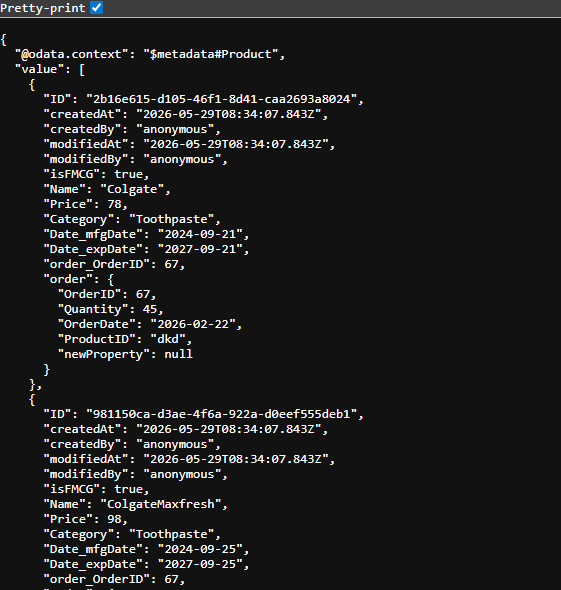
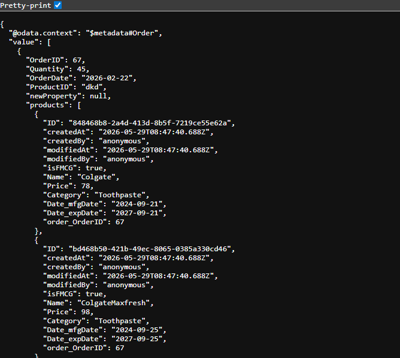
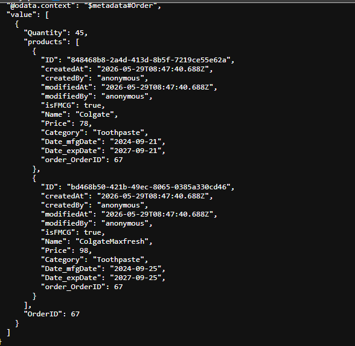
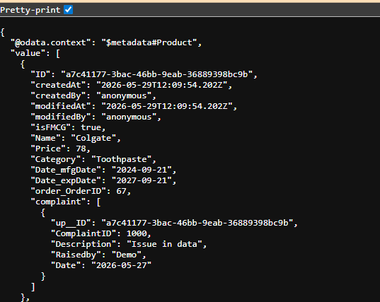

# Getting Started

Welcome to your new CAP project.

It contains these folders and files, following our recommended project layout:

File or Folder | Purpose
---------|----------
`app/` | content for UI frontends goes here
`db/` | your domain models and data go here
`srv/` | your service models and code go here
`readme.md` | this getting started guide

## Next Steps

- Open a new terminal and run `cds watch`
- (in VS Code simply choose _**Terminal** > Run Task > cds watch_)
- Start with your domain model, in a CDS file in `db/`

## Learn More

Learn more at <https://cap.cloud.sap>.

## Expand Example

get expanded data
GET http://localhost:4004/odata/v4/shop/Product?$expand=order

GET http://localhost:4004/odata/v4/shop/Order?$expand=products

### Select Example for Select - Quantity

GET http://localhost:4004/odata/v4/shop/Order?$expand=products&$select=Quantity

### Composition Example for Complaint
GET http://localhost:4004/odata/v4/shop/Product?$expand=complaint

